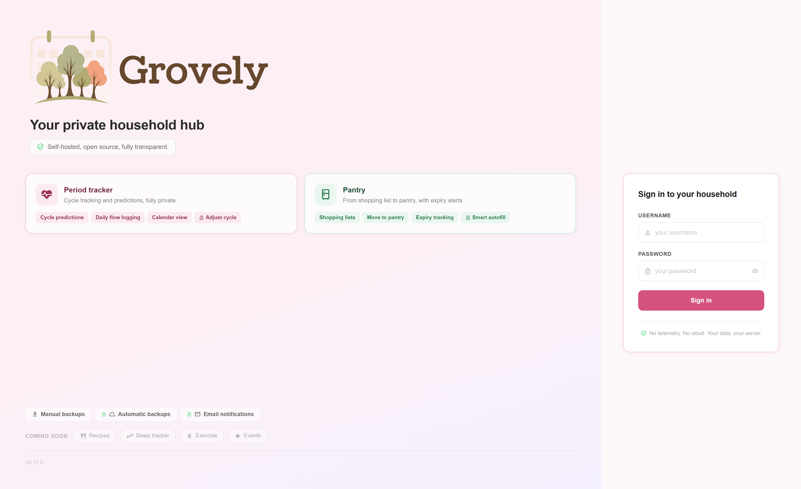
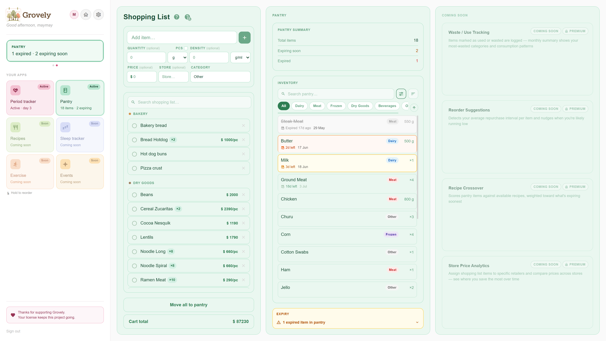

<p align="center">
  <picture>
    <source media="(prefers-color-scheme: dark)" srcset="grovely-frontend/src/assets/Logo README Dark.png">
    <source media="(prefers-color-scheme: light)" srcset="grovely-frontend/src/assets/Logo README Light.png">
    
  </picture>
</p>

<table align="center">
  <tbody>
    <tr>
      <td><a href="https://www.gnu.org/licenses/agpl-3.0"></a></td>
      <td><a href="https://github.com/Moriyarnn/grovely-app/actions/workflows/docker-publish.yml"></a></td>
      <td></td>
      <td></td>
      <td></td>
      <td></td>
    </tr>
  </tbody>
</table>

<p align="center">Self-hosted household hub with couples support - period tracking, shared pantry, and more on the way.</p>

<p align="center">When my wife and I moved in together, we realized every period tracker charged $40/year and sold the data, and nothing handled the rest of the household either. So I built Grovely. Every problem we ran into became a feature that tied everything together, and there's so much more we want to build.</p>

<p align="center"><a href="https://try.grovely.org"><strong>Try the demo</strong></a> - if you have any thoughts or feedback, the application includes an easy way to submit it.</p>

<table align="center">
  <tbody>
    <tr>
      <td width="33.33%"></td>
      <td width="33.33%"></td>
      <td width="33.33%"></td>
    </tr>
  </tbody>
</table>
<p align="center"><em>Period tracker · Pantry inventory · Scheduled backups</em></p>

## Quick Start

### Easy install (recommended)

1. Make sure [Docker Desktop](https://docs.docker.com/get-docker/) is installed and running
2. Download the installer for your system:
   - **Linux / Mac:** [run-to-install.sh](https://grovely.org/install/run-to-install.sh)
   - **Windows:** [run-to-install.ps1](https://grovely.org/install/run-to-install.ps1)
3. Run it:
   - **Linux / Mac:** open a terminal where you saved the file and run `bash run-to-install.sh`
   - **Windows:** right-click `run-to-install.ps1` and choose "Run with PowerShell"
4. Follow the instructions on screen to set up your accounts. Once done, you will be given the option to open Grovely in your browser automatically.

Open **http://localhost:5173** and log in.

### Manual install

```bash
mkdir grovely && cd grovely
curl -LO https://github.com/Moriyarnn/grovely-app/releases/latest/download/docker-compose.yml
curl -L -o .env https://github.com/Moriyarnn/grovely-app/releases/latest/download/example.env
```

Edit `.env` and set the usernames and passwords for both accounts, then:

```bash
docker compose up -d
```

See [INSTALL.md](./INSTALL.md) for full instructions including reverse proxy setups (Caddy, Nginx, Traefik, Nginx Proxy Manager), backups, license keys, and troubleshooting.

## Features

### Period Tracker

- Two logging modes: tap day-by-day while active, or log a complete date range retrospectively
- Flow intensity per day (spotting, light, medium, heavy) - tints the calendar so you can see patterns at a glance
- Symptom logging per day with free-text notes
- Cycle predictions powered by exponential smoothing - adapts to your history, learns your personal luteal phase length, self-corrects from past errors
- Confidence window for irregular cycles - shows a range instead of a false precise date
- Irregularity detection and data quality warnings (future-dated cycles, short gaps, abnormally long periods)
- Delete a single day from a cycle edge, or delete a complete cycle
- Current Phase card - shows today's phase (follicular, ovulatory, luteal, menstrual) with a confidence label based on logged data or prediction (premium)
- Adjust Cycle - hold-drag to resize a cycle's start or end without deleting and re-logging (premium)
- Animated onboarding tutorial covering all three logging flows
- Full cycle history with detail view per cycle

### Pantry & Shopping List

- Shared shopping list - both partners can add, check off, and remove items
- Categories, quantities, units, and price tracking per item
- Move-to-pantry flow - checked items transfer to inventory with an optional expiry date
- Expiry tracking with 5 visual states (fresh, expiring soon, expiring very soon, expires today, expired)
- Suggested expiry on move-to-pantry based on past shelf life for that item
- Merge hints when adding an item that already exists in the pantry ("Adds 500 ml to existing")
- Smart Autofill - autocomplete backed by your full purchase history, pre-fills quantity, unit, price, and store with a price delta so you know if it's more expensive than usual (premium)

### Notifications

- 18 email notification types covering period alerts, fertile window, partner-facing nudges, and pantry expiry (premium)
- Daily cron at a configurable time with startup catch-up for missed windows
- Works with any SMTP provider - Gmail, Resend, Mailgun, self-hosted
- Fully opt-in: no emails sent unless you configure SMTP credentials

### Backups

- Manual on-demand backup download from the settings panel (free)
- Scheduled automatic backups - daily cron, configurable time, local retention with startup catch-up (premium)
- Remote push to S3-compatible storage or WebDAV targets (premium)
- Backup history with per-destination status, verify, and restore from the UI (premium)

### Accounts & Access

- Two equal accounts - both partners have full access to all shared features (pantry, notifications)
- Period data is private to the account that logged it (your account, owner1) - your partner's account (owner2) sees read-only
- JWT authentication with credentials set via environment variables on first run

### Deployment

- Docker Compose with multi-arch images (amd64 + arm64) - runs on x86, Raspberry Pi, Synology, anything
- One command deploy: `docker compose up -d`
- Installable as a PWA - add to home screen on iOS and Android for a native app feel
- Reverse proxy ready - ships overlay files for Caddy, Nginx, Traefik, and dockerized proxy setups
- SQLite database - no external DB server, everything in one file you own
- Built-in release awareness - Grovely checks its public release feed so both partners can see available fixes and update safely

## Screenshots

### Desktop

<p align="center">
  
</p>
<p align="center"><em>Private household hub - the landing and sign-in page</em></p>

<p align="center">
  
</p>
<p align="center"><em>Period tracker - calendar with logged cycle, current phase, and predictions</em></p>

<p align="center">
  
</p>
<p align="center"><em>Shared shopping list and pantry inventory with expiry tracking</em></p>

### Mobile

<p align="center">
  
</p>
<p align="center"><em>Notification settings</em></p>

### Demos

<table align="center">
  <tbody>
    <tr>
      <td width="50%"></td>
      <td width="50%"></td>
    </tr>
  </tbody>
</table>
<p align="center"><em>Drag to log a period and adjust a cycle · Add an item and move it to the pantry</em></p>

## Roadmap

**Next (Q3 2026)**
- Pantry premium expansion - waste and use tracking with monthly summaries, reorder suggestions based on your repurchase history, store price analytics, shopping wizard, Home Assistant webhook (premium)
- Advanced period analytics - cycle data export (CSV/PDF), symptom pattern prediction, trend detection, cycle correlation over time, BBT and OPK logging (premium)
- SSO/OIDC support - Authelia, Authentik, Cloudflare Access

**Later (Q4 2026)**
- Sleep tracker - manual logging, weekly chart, morning nudge notification, partner sync (premium)
- Exercise tracker - log workouts, phase-aware energy suggestions, cycle correlation (premium)
- Push notifications for browser and PWA
- Multi-language support

**Future**
- Recipes with cycle-phase matching and pantry crossover ("what can I cook with what's in the pantry?")
- Cross-feature analytics - sleep and exercise patterns correlated with cycle phases
- Shared weekly digest for both partners
- Symptom-triggered suggestions across features (recipes, exercise, partner nudges)
- Android and iOS native apps
- Themes

## Tech Stack

- **Frontend:** Vue 3 + TypeScript + Vuetify
- **Backend:** Express 5 + SQLite (better-sqlite3)
- **Infra:** Docker Compose - dev (HMR), UAT, and prod environments

## Privacy

No telemetry or household-data collection. Your household data stays on your server. Grovely checks its public release feed once per day so it can show available fixes. That request sends no account, license, installed-version, usage, or household data, and can be disabled with `UPDATE_CHECK_ENABLED=false`. SMTP and remote backups remain opt-in.

## Pricing

Grovely is **open core** - the core is free forever, and the premium tier funds continued development.

**Free (AGPL-3.0):**
- Period tracker - calendar, flow intensity, predictions, fertile windows
- Both partner accounts
- Shared grocery list and pantry with expiry tracking
- Manual on-demand backups

**Premium - $20/year (monthly option available):**
- Full notification system - all 18 types, partner-facing versions, any SMTP provider
- Scheduled automatic backups - local retention plus S3-compatible and WebDAV remote push
- Smart Autofill on the shopping list - purchase history autocomplete with price delta
- Adjust Cycle and the Current Phase card on the period tracker

More premium features are on the [roadmap](#roadmap), and the price stays $20/year regardless of what's added. License verification is readable offline JWT verification against a public key baked into the image - it contacts no license server and makes no network call.

**Get a license → https://grovely.lemonsqueezy.com/**

Prefer to support without premium? You can sponsor development on [Ko-fi](https://ko-fi.com/sebastianverdugo) or [GitHub Sponsors](https://github.com/sponsors/Moriyarnn).

## License

AGPL-3.0 open core. Email notifications, automatic backups, and advanced features require a $20/year offline license key - offline validation with no license-server calls.
